# Color Conversion
## AIM
To perform the color conversion between RGB, BGR, HSV, and YCbCr color models.

## Software Required:
Anaconda - Python 3.7
## Algorithm:
### Step1:
Import cv2 and save and image as filename.jpg

### Step2:
Use imread(filename, flags) to read the file.


### Step3:
Use cv2.cvtColor(src, code, dst, dstCn) to convert an image from one color space to another

### Step4:
Split and merge the image using cv2.split and cv2.merge commands.


### Step5:
End the program and close the output image windows.

## Program:
```python
# Developed By: Shobika P
# Register Number:212221230096
```
# i)Original Image 
```
import cv2
img=cv2.imread('mo.jpg')
cv2.imshow('Org_img',img)
cv2.waitKey(0)
cv2.destroyAllWindows()
```
# ii) Convert BGR and RGB to HSV and GRAY
```
hsv_img=cv2.cvtColor(img,cv2.COLOR_BGR2HSV)
cv2.imshow('BGR2HSV',hsv_img)
cv2.waitKey(0)
cv2.destroyAllWindows()

hsv_img1=cv2.cvtColor(img,cv2.COLOR_RGB2HSV)
cv2.imshow('RGB2HSV',hsv_img1)
cv2.waitKey(0)
cv2.destroyAllWindows()

gray_img=cv2.cvtColor(img,cv2.COLOR_BGR2GRAY)
cv2.imshow('BGR2GRAY',gray_img)
cv2.waitKey(0)
cv2.destroyAllWindows()

gray_img1=cv2.cvtColor(img,cv2.COLOR_RGB2GRAY)
cv2.imshow('RGB2GRAY',gray_img1)
cv2.waitKey(0)
cv2.destroyAllWindows()

```


# iii)Convert HSV to RGB and BGR

```


rgb_img=cv2.cvtColor(hsv_img,cv2.COLOR_HSV2RGB)
cv2.imshow('HSV to RGB',rgb_img)
cv2.waitKey(0)
cv2.destroyAllWindows()

bgr_img=cv2.cvtColor(hsv_img,cv2.COLOR_HSV2BGR)
cv2.imshow('HSV to BGR',bgr_img)
cv2.waitKey(0)
cv2.destroyAllWindows()


```


# iv)Convert RGB and BGR to YCrCb

```
YCrCb_1 = cv2.cvtColor(rgb_img, cv2.COLOR_RGB2YCrCb)
cv2.imshow('YCrCb_1',YCrCb_1)
cv2.waitKey(0)
cv2.destroyAllWindows()

YCrCb_2 = cv2.cvtColor(bgr_img, cv2.COLOR_BGR2YCrCb)
cv2.imshow('YCrCb_2',YCrCb_2)
cv2.waitKey(0)
cv2.destroyAllWindows()
```


# v)Split and Merge RGB Image

```
blue = img[:,:,0]
green = img[:,:,1]
red = img[:,:,2]
cv2.merge((blue,green,red))
```


# v) Split and merge HSV Image
```

h, s, v = cv2.split(hsv_img)
cv2.merge((h,s,v))

```
## Output:
### i) Original Image 

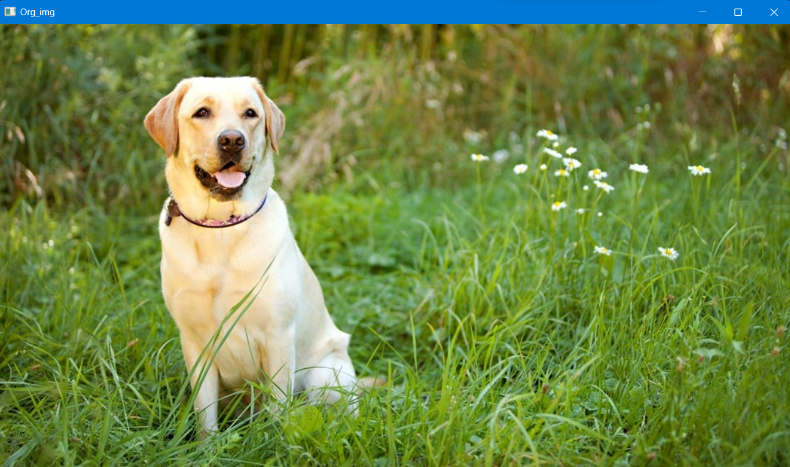

### i) BGR and RGB to HSV and GRAY

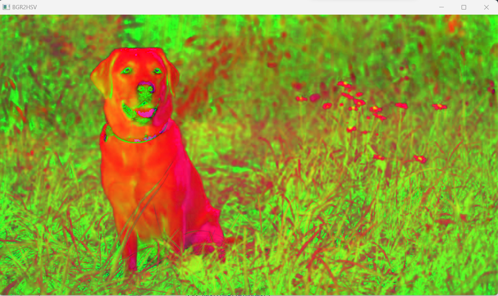
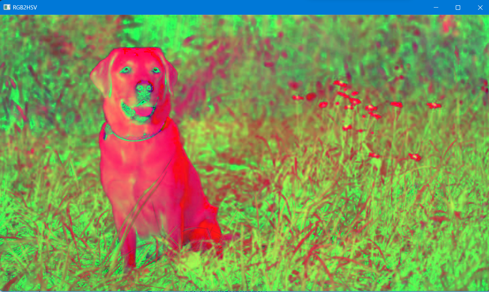
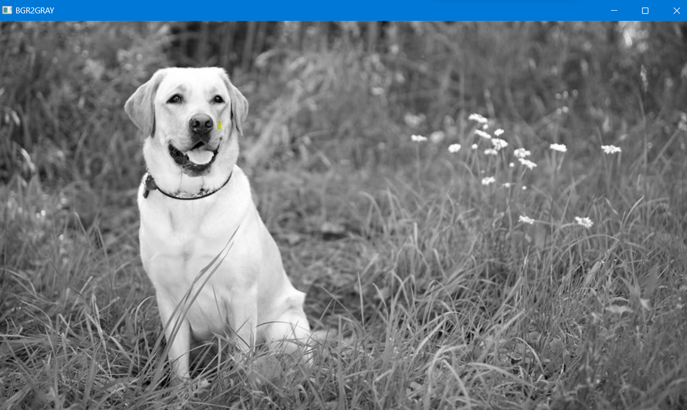
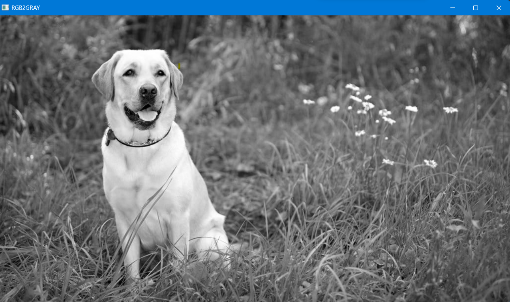

### ii) HSV to RGB and BGR

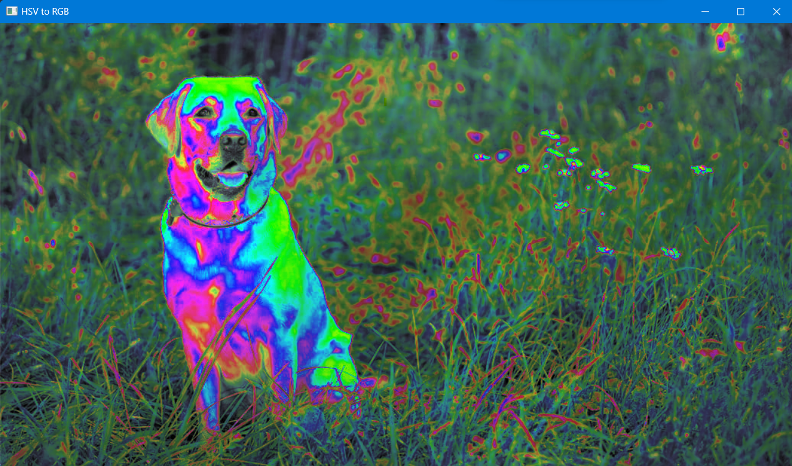
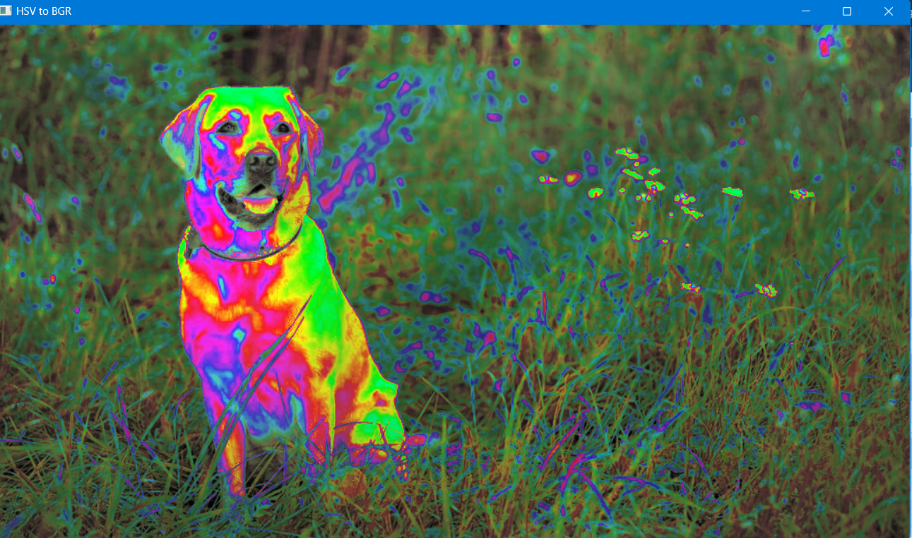

### iii) RGB and BGR to YCrCb

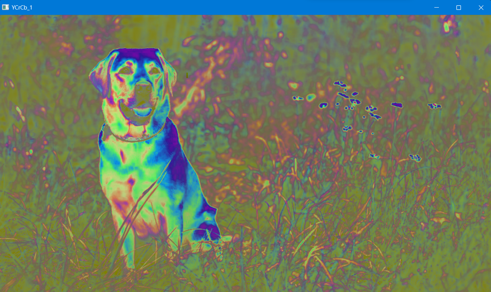
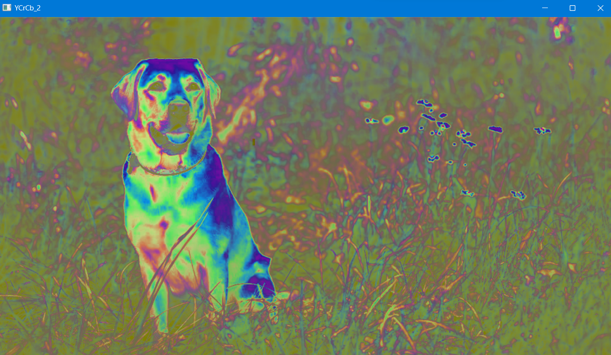

### iv) Split and merge RGB Image

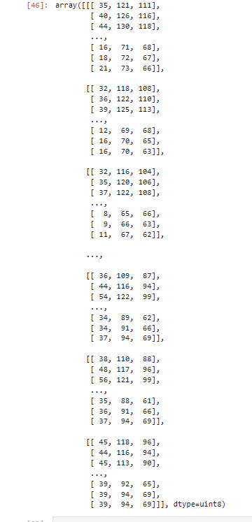

### v) Split and merge HSV Image

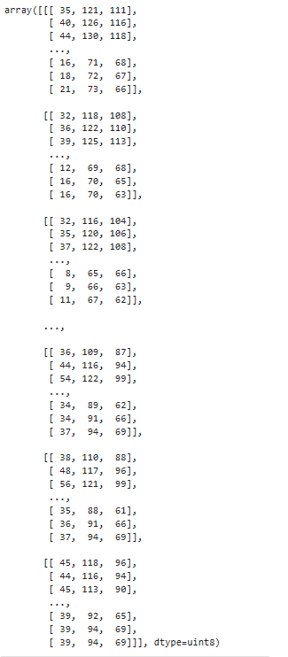

## Result:
Thus the color conversion was performed between RGB, HSV and YCbCr color models.
